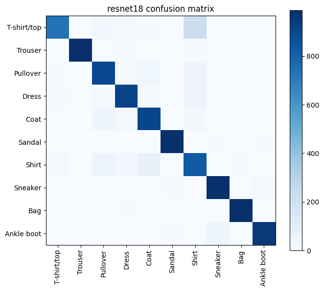
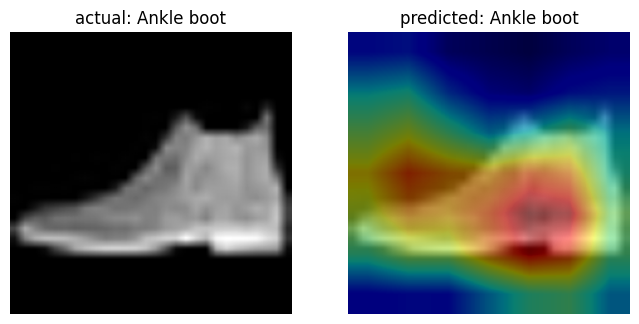

# Vision Upload: Fashion Classifier

Drop an image of a clothing item and get its category back. Started as a scikit-learn pipeline; now served by a fine-tuned ResNet18, after comparing it against a from-scratch CNN and the original baseline.


## Model

- **Dataset:** [Fashion-MNIST](https://github.com/zalandoresearch/fashion-mnist), 70,000 grayscale 28x28 images, 10 classes
- **Classes:** T-shirt/top, Trouser, Pullover, Dress, Coat, Sandal, Shirt, Sneaker, Bag, Ankle boot

Three approaches were trained and compared on the test set:

| Model | Test accuracy |
|---|---|
| scikit-learn pipeline (original) | 90.70% |
| Simple CNN, trained from scratch (2 conv layers) | 90.91% |
| **ResNet18, fine-tuned (ImageNet-pretrained)** | **91.73%** |


ResNet18 is the model currently served by the API.

### Why transfer learning barely helped

The three results are within about 1 point of each other, which is a real and informative result, not a weak one. Transfer learning helps most when the pretraining domain is *similar* to the target domain and the target dataset is *small*. Neither applies here: ResNet18 was pretrained on full-color, high-resolution ImageNet photos (textures, lighting, backgrounds), while Fashion-MNIST is tiny (28x28), grayscale, and background-free — a large domain mismatch. And with 60,000 training images available, a small CNN already has enough data to learn good task-specific features from scratch, so pretraining's usual advantage (compensating for too little data) doesn't apply. Transfer learning would matter far more on a smaller, more photo-realistic dataset.

### Where the model struggles



The confusion is concentrated almost entirely around **Shirt, T-shirt/top, Pullover, and Coat** — all other classes are nearly perfectly separated. These four classes share the same rough upper-body-clothing silhouette, and at 28x28 resolution the fine details that would tell them apart (collar shape, sleeve length, texture) are mostly lost to downsampling.

### Grad-CAM: checking the model isn't cheating



Grad-CAM highlights which pixels drove a prediction. Unlike natural-image classifiers, where one small, distinctive region is often enough (an ear, a badge), the heatmap here lights up almost the **entire object**. That's expected: with no color or texture, the only information available is the object's silhouette, so the discriminating signal is spread across the whole shape rather than concentrated in one local feature. This confirms the model is using sensible whole-shape reasoning, not a shortcut or background artifact.

## How it works

1. The page sends the dropped image to `POST /predict`.
2. FastAPI converts it to grayscale, resizes and reformats it to match ResNet18's expected input (3-channel, 224x224, ImageNet normalization).
3. The image goes through the model, which returns the predicted class and a confidence score.
4. The label is shown in the UI.

## Known limitation

The model is trained and evaluated only on clean Fashion-MNIST images (centered, plain background), so real photos with backgrounds, clutter, or unusual angles will likely perform worse than the 91.7% test accuracy suggests. No data augmentation was used during training, which would be the natural next step to improve robustness to real-world input.

## Run locally

```bash
git clone https://github.com/varun-aahil/vision-upload-service.git
cd vision-upload-service
pip install -r requirements.txt
uvicorn main:app --reload
```

Open http://127.0.0.1:8000 and drop an image.

## Tech stack

Python, PyTorch, torchvision, FastAPI, Pillow

## Next steps

- Add data augmentation (random crop, flip, slight rotation) to improve robustness on real photos
- Add per-class precision/recall/F1 comparison across all three models
- Add confidence scores and the top 3 predictions to the response